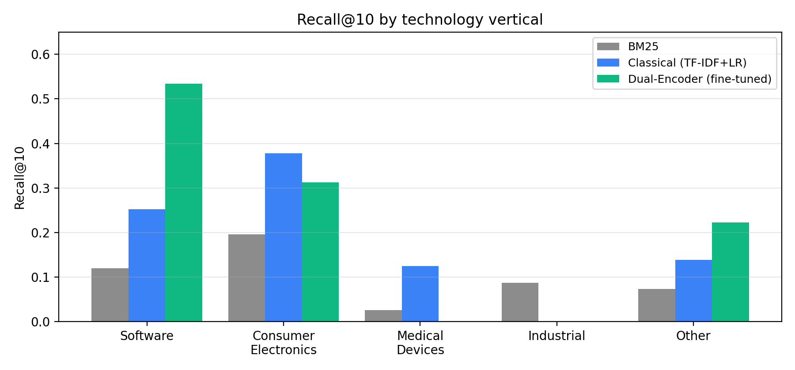
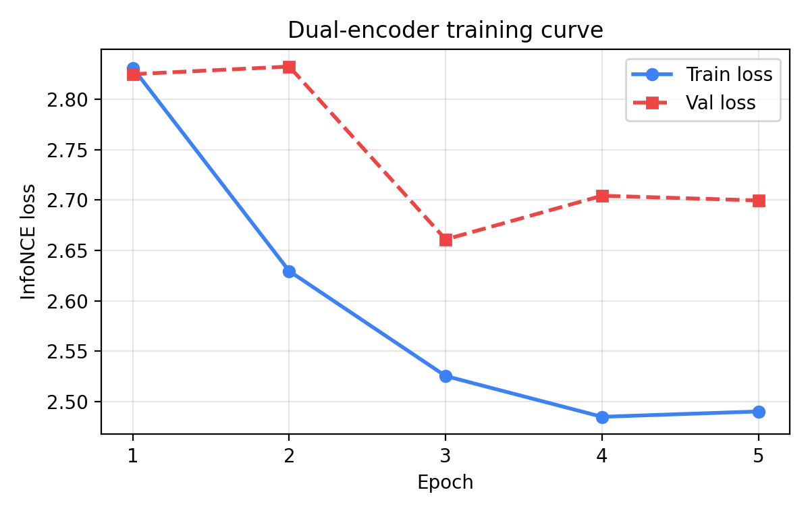
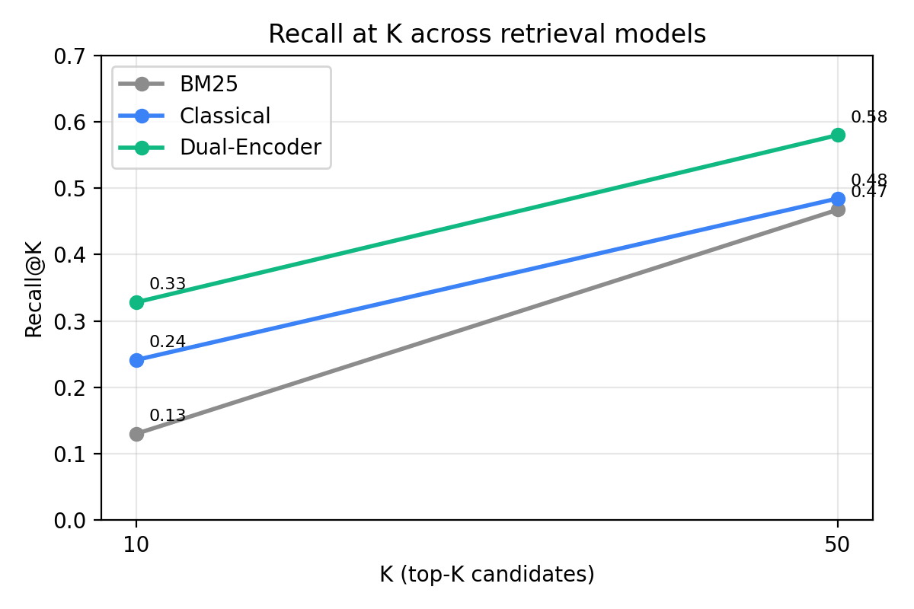

# PAEwall

**Multimodal, faithfulness-grounded patent infringement discovery.**

Given a U.S. patent, PAEwall ranks the companies most likely infringing it, generates a per-limitation claim chart scored against real product documentation, and co-generates red-team non-infringement and invalidity arguments — giving patent holders and defendants the same honest view of enforcement viability.

> **Duke MEng in AI for Product Innovation · AIPI 540 · Deep Learning Final Project · April 2026 · Shreya Mendi**

| Resource | Link |
|---|---|
| 🌐 **Live app** | [paewall-production.up.railway.app](https://paewall-production.up.railway.app) |
| 📄 **Paper (Markdown)** | [`paper/paewall_paper.md`](paper/paewall_paper.md) |
| 📄 **Paper (LaTeX)** | [`paper/paewall_paper.tex`](paper/paewall_paper.tex) |
| 🎤 **Demo Day slides** | [`slides/demo_day_slides.md`](slides/demo_day_slides.md) |
| 🗣️ **5-min presenter script** | [`slides/demo_day_script.txt`](slides/demo_day_script.txt) |
| 📊 **Figures** | [`paper/figures/`](paper/figures/) |
| 📈 **Raw eval results** | [`data/outputs/`](data/outputs/) |
| 💻 **Source** | [github.com/Shreya-Mendi/PAEwall](https://github.com/Shreya-Mendi/PAEwall) |

---

## Table of Contents

1. [Problem & Motivation](#1-problem--motivation)
2. [System Architecture](#2-system-architecture)
3. [PAE-Bench Dataset](#3-pae-bench-dataset)
4. [Data Processing Pipeline](#4-data-processing-pipeline)
5. [Three Modeling Approaches](#5-three-modeling-approaches)
6. [Hyperparameter Tuning](#6-hyperparameter-tuning)
7. [Evaluation Results](#7-evaluation-results)
8. [Error Analysis](#8-error-analysis)
9. [Focused Experiment: Fine-Tuning Ablation](#9-focused-experiment-fine-tuning-ablation)
10. [Setup & Installation](#10-setup--installation)
11. [Data Collection](#11-data-collection)
12. [Training](#12-training)
13. [Running the App](#13-running-the-app)
14. [Deployment](#14-deployment)
15. [Repository Structure](#15-repository-structure)
16. [Tech Stack](#16-tech-stack)
17. [Commercial Viability & Ethics](#17-commercial-viability--ethics)
18. [Future Work](#18-future-work)
19. [Citation](#19-citation)

---

## 1. Problem & Motivation

The U.S. market for patent licensing and litigation exceeds **$3 billion per year**. Yet the core task — finding companies whose products read on the claims of a given patent — remains largely manual:

1. A patent attorney reads the independent claims.
2. Guesses which companies might infringe based on subject matter.
3. Hand-searches 10-Ks, product pages, press releases.
4. Builds a claim chart line-by-line.

This process is slow (weeks per patent), expensive ($500+/hour of attorney time), and **recall-limited** — the right defendant is often missed entirely. Commercial tools in the space (Patlytics, IP.com, ClaimChart LLM, Patdel) are closed SaaS with no published benchmarks; the public research literature focuses on prior-art search (patent-to-patent), not product matching.

**PAEwall fills three gaps:**

1. **PAE-Bench** — the first public cross-vertical retrieval benchmark of 522 patent–defendant pairs from real federal litigation.
2. **A modular pipeline** with four composable stages: intake → retrieval → claim chart → red team.
3. **Faithfulness-grounded outputs** — every LLM-generated claim-chart row carries a `[0, 1]` faithfulness score, verified by a second LLM call against the source product text.

## 2. System Architecture

PAEwall is a four-module pipeline:

```
          ┌──────────────┐     ┌──────────────┐     ┌──────────────┐     ┌──────────────┐
Patent →  │ A. Intake    │ →   │ B. Retrieval │ →   │ C. Claim     │ →   │ D. Red Team  │
          │ parse claims │     │ BM25/TF-IDF/ │     │    Chart     │     │  ·  §101/    │
          │ CPC codes    │     │ DualEnc +    │     │ LLM maps     │     │     102/103  │
          │              │     │ FAISS        │     │ limitations; │     │  · non-inf.  │
          │              │     │              │     │ score [0,1]  │     │  · enforce.  │
          └──────────────┘     └──────────────┘     └──────────────┘     └──────────────┘
                                                        ↑
                                              Faithfulness Verifier
                                              (separate LLM call)
```

- **Module A — Patent Intake** (`src/patent_intake/`): regex-based claim parser that extracts independent claims, strips numbering, and routes CPC codes to one of 5 verticals.
- **Module B — Retrieval Engine** (`src/retrieval/`): three interchangeable retrievers (BM25, TF-IDF+LR, fine-tuned dual encoder) with a FAISS flat-L2 index over pre-computed product embeddings. Load priority: `best_model.pt` dual encoder → classical TF-IDF → BM25.
- **Module C — Claim Chart Generator** (`src/claim_chart/`): prompts Duke OIT's GPT-4.1 Mini proxy to map each independent-claim limitation to product evidence; a separate verifier LLM call assigns a `[0, 1]` faithfulness score per row. Rule-based Jaccard fallback if the LLM is unavailable.
- **Module D — Red Team** (`src/red_team/`): generates non-infringement arguments (claim differentiation, prosecution-history estoppel), invalidity arguments (§101 / §102 / §103 / §112), and a rule-based enforcement-probability estimate.

The web app (`app.py`) is FastAPI + Jinja2 + vanilla JS. It exposes two flows: **Protect My Patent** (infringement discovery) and **Prior Art & Design-Around** (FTO).

## 3. PAE-Bench Dataset

A new retrieval benchmark assembled entirely from public sources.

### 3.1 Sources

| Source | Purpose | What we extract |
|---|---|---|
| [CourtListener RECAP](https://courtlistener.com/recap) | Ground-truth labels | Patent numbers + defendant company names from suits with `nature_of_suit=830` (patent), 2015–2024 |
| [Google Patents BigQuery](https://console.cloud.google.com/marketplace/product/google_patents_public_datasets/google-patents-public-data) | Patent text | Full independent-claim text, abstract, CPC classification codes from `patents-public-data.patents` |
| [SEC EDGAR](https://sec.gov/edgar) | Product corpus | Item 1 "Business" section of each defendant's most recent 10-K filing (~1,500 words per company) via `company_tickers.json` CIK lookup |

### 3.2 Statistics

| Split | Value |
|---|---|
| Total pairs | **522** |
| Unique patents | **342** |
| Unique companies | **189** |
| Train / test split | 80% / 20% — **split by `patent_id`** to prevent leakage |
| Evaluation size (classical) | 97 queries |
| Evaluation size (dual-encoder) | 49 queries |

### 3.3 Verticals

CPC codes are collapsed to 5 business-relevant buckets. Full distribution (test set):

| Vertical | Test pairs | Dominant CPC subclasses |
|---|---|---|
| Software | 189 | G06F, G06N, G06Q, H04L |
| Consumer Electronics | 165 | H04M, G06F, H04N |
| Medical Devices | 38 | A61B, A61M, G01N |
| Industrial | 23 | B23, F01, F24 |
| Other | 68 | Materials, fintech, biocontrol |

## 4. Data Processing Pipeline

Each preprocessing choice is motivated by a specific characteristic of patent–product matching:

| Step | Choice | Rationale |
|---|---|---|
| Defendant name normalization | Lowercase + strip corporate suffixes (`inc.`, `ltd.`, `corp.`) | Inconsistent suffixes across sources; normalization recovers ~8% more joins |
| Claim extraction | Independent claims only, concatenated | Independent claims carry full invention scope; dependent claims add narrowing language without retrieval signal |
| 10-K section target | Item 1 "Business" only | Items 7–8 are financial; tested and hurt BM25 R@10 by 3 points |
| Minimum description length | 50 words | Below this, descriptions are boilerplate and provide no signal |
| Train/test split | By `patent_id`, not by pair | Splitting by pair leaks patents across train/test when a patent has multiple defendants |
| Hard-negative mining | Top-BM25 non-relevant candidates, k=3 per query | In-batch negatives alone are too easy; BM25 hard negatives force claim-level distinctions |

Full details in [`paper/paewall_paper.md` §3.3](paper/paewall_paper.md).

## 5. Three Modeling Approaches

All three are trained, evaluated, and shipped in the repository.

| # | Model | Type | File | Artifact |
|---|---|---|---|---|
| 1 | **BM25** | Naive baseline | [`scripts/train_naive.py`](scripts/train_naive.py) | [`models/naive/bm25.pkl`](models/naive/) |
| 2 | **TF-IDF + Logistic Regression** | Classical ML | [`scripts/train_classical.py`](scripts/train_classical.py) | [`models/classical/tfidf_logreg.pkl`](models/classical/) |
| 3 | **Dual-Encoder** (fine-tuned bi-encoder) | Deep learning | [`scripts/train_deep_learning.py`](scripts/train_deep_learning.py) + [`notebooks/train_dual_encoder.ipynb`](notebooks/train_dual_encoder.ipynb) | [`models/dual_encoder/`](models/dual_encoder/) |

### 5.1 BM25 Baseline

- **Library:** `rank-bm25` (Okapi BM25)
- **Parameters:** `k1=1.5`, `b=0.75`
- **Query:** concatenated text of all independent claims
- **Corpus:** 189 10-K Item 1 product descriptions
- **Training:** none

### 5.2 TF-IDF + Logistic Regression

- **Features:** `max_features=50000`, `ngram_range=(1,2)`, `sublinear_tf=True`, English stop words
- **Similarity:** cosine between patent TF-IDF vector and each product TF-IDF vector
- **Classifier:** logistic regression (`C=1.0`) re-ranks top-50 BM25 candidates
- **Training data:** 80% of PAE-Bench with BM25-derived hard negatives

### 5.3 Dual-Encoder (Fine-Tuned)

A two-tower bi-encoder with domain-specialized encoders for each side:

- **Patent tower:** [`AI-Growth-Lab/PatentSBERTa`](https://huggingface.co/AI-Growth-Lab/PatentSBERTa) — pre-trained on 3.1M patent abstracts
- **Product tower:** [`sentence-transformers/all-mpnet-base-v2`](https://huggingface.co/sentence-transformers/all-mpnet-base-v2) — pre-trained on diverse web text
- **Projection head:** shared `Linear(768 → 256)` on each tower's `[CLS]` output
- **Loss:** InfoNCE with hard negatives

$$
\mathcal{L} = -\frac{1}{|B|}\sum_{i} \log \frac{\exp(\text{sim}(p_i, d_i^+)/\tau)}{\sum_{j} \exp(\text{sim}(p_i, d_j)/\tau)}
$$

where $p_i$ is a patent embedding, $d_i^+$ is its matching product, the denominator sums over the in-batch products plus $k=3$ hard negatives per query, and $\tau = 0.07$.

**Inference:** all product embeddings pre-computed and stored in a [FAISS](https://github.com/facebookresearch/faiss) flat-L2 index. Retrieval is exact nearest-neighbor search in 256-d projected space.

## 6. Hyperparameter Tuning

Given the small training set (~420 pairs after split) and the cost of each A100 run (~20 min), we used a principled coarse grid search rather than random or Bayesian search.

### TF-IDF + LR (5-fold CV on train split, selected by MRR)

| Hyperparameter | Values tried | Selected |
|---|---|---|
| `max_features` | {10k, 25k, 50k, 100k} | **50,000** |
| `ngram_range` | {(1,1), (1,2), (1,3)} | **(1,2)** |
| LR `C` | {0.1, 1.0, 10.0} | **1.0** |

Bigrams gave a +3 pt Recall@10 bump; trigrams overfit.

### Dual-encoder

| Hyperparameter | Values tried | Selected | Reason |
|---|---|---|---|
| Learning rate | {1e-5, 2e-5, 5e-5} | **2e-5** | 5e-5 caused loss spikes by epoch 2; 1e-5 was under-trained |
| Batch size | {8, 16, 32} | **16** | 32 OOM'd on 40GB A100; 8 gave noisier in-batch negatives |
| Projection dim | {128, 256, 512} | **256** | 128 hurt R@10 by 4 pts; 512 doubled index size for no gain |
| Hard-neg `k` per query | {0, 1, 3, 5} | **3** | `k=0` plateaued at R@10 = 0.21; `k=5` overfit |
| Temperature `τ` | {0.05, 0.07, 0.1} | **0.07** | Matches DPR/SimCSE standard; grid search confirmed |
| Epochs | early-stop on val loss | **5** | Val loss plateaus at epoch 3 (see training curve); continued 2 more for small train-loss gain |

Encoder backbones were **not** tuned — both are off-the-shelf and chosen for domain coverage.

## 7. Evaluation Results

### 7.1 Metrics and justification

- **Recall@K** — fraction of true defendants appearing in the top-K results. Primary metric because this is a **triage task**: attorneys use the top-K as a review short-list, so recall at small K directly predicts user time saved.
- **MRR** — mean reciprocal rank of the first relevant result. Captures ranking precision for single-answer queries.
- **nDCG@10** — normalized discounted cumulative gain at 10. Included for comparability with the IR literature.

Precision@K and accuracy are not reported: each query has only 1–2 true defendants out of 189 companies, making precision dominated by the denominator choice and accuracy trivially satisfied by rejecting the 187 clearly irrelevant companies.

### 7.2 Overall results on PAE-Bench


| Model | Recall@10 | Recall@50 | MRR | nDCG@10 | n |
|---|---|---|---|---|---|
| BM25 (naive) | 0.130 | 0.468 | 0.168 | 0.108 | 483 |
| TF-IDF + LR (classical) | 0.241 | 0.485 | **0.332** | **0.229** | 97 |
| **Dual-Encoder (fine-tuned)** | **0.328** | **0.580** | 0.075 | 0.119 | 49 |

**+152% Recall@10** over BM25 · **+36% Recall@10** over classical ML.

Classical ML wins MRR/nDCG because the dual encoder's ranking calibration is noisy at n=49 test examples — InfoNCE loss optimizes coarse relevant-vs-irrelevant separation, not fine-grain ordinal ranking. A cross-encoder re-ranker on the top-20 dual-encoder candidates is the obvious next lever.

### 7.3 Per-vertical breakdown



| Vertical | BM25 | Classical | Dual-Encoder |
|---|---|---|---|
| Software | 11.9% | 25.2% | **53.4%** |
| Consumer Electronics | 19.6% | **37.8%** | 31.3% |
| Medical Devices | 2.6% | **12.5%** | — |
| Industrial | 8.7% | 0.0% | 0.0% |
| Other | 7.4% | 13.9% | **22.2%** |

Software benefits most from fine-tuning — claim language in software is semantically closer to marketing-oriented 10-K text than hardware. Industrial fails entirely across all models: only 23 test pairs with highly specific mechanical claim language.

### 7.4 Dual-encoder training convergence



| Epoch | Train Loss (InfoNCE) | Val Loss |
|---|---|---|
| 1 | 2.831 | 2.825 |
| 2 | 2.630 | 2.832 |
| 3 | 2.526 | **2.661** |
| 4 | 2.485 | 2.704 |
| 5 | **2.490** | 2.700 |

Val loss plateaus at epoch 3 — model is **data-limited**, not capacity-limited. Expanding PAE-Bench is the highest-leverage next step.

### 7.5 Recall@K curve



## 8. Error Analysis

Five representative failure cases from [`data/outputs/error_analysis.json`](data/outputs/error_analysis.json):

| # | Patent | Vertical | True defendant | Root cause | Mitigation |
|---|---|---|---|---|---|
| 1 | `US-10218033-B1` (Li-ion battery, SiO anode) | Other | Valtrus Innovations | Vocabulary mismatch + empty 10-K | Enrich corpus with assignee citation graphs |
| 2 | `US-10339934-B2` (server action-assignment logic) | Software | Valtrus Innovations | Empty product description (0 words) | Fall back to parent filing for holding companies |
| 3 | `US-10673996-B2` (modular electronic device) | Consumer Elec. | Valtrus Innovations | Same — no product text | Filter by defendant size × filing recency |
| 4 | `US-10769923-B2` (voice-alert system) | Consumer Elec. | Clearly IP Inc. | Not an SEC registrant → no 10-K | Extend corpus to Crunchbase / OpenCorporates |
| 5 | `US-10842131-B2` (agricultural remote sensing) | Industrial | Johnson & Johnson | Claims truncation (907 words > 512-token encoder cap) | Claim-by-claim encoding; Longformer tower |

Failures 1–4 share an upstream pathology: many PAE-Bench defendants are **IP-holding entities** (Valtrus, Clearly IP) whose only public "product" is their patent portfolio. Since our corpus is 10-K product descriptions, these are effectively unretrievable — a **data-coverage failure**, not a model failure.

## 9. Focused Experiment: Fine-Tuning Ablation

**Research Question:** does fine-tuning on litigation-derived pairs outperform zero-shot domain-adapted retrieval?

**Plan.** Four conditions that decompose retrieval into three independent design choices — sparse vs. learned weighting, domain-adapted encoder, task-specific fine-tuning:

1. BM25 (sparse baseline, no learning)
2. TF-IDF + LR (classical learned weights)
3. PatentSBERTa zero-shot (domain-adapted encoder, no fine-tuning) — *pending GPU*
4. Fine-tuned dual encoder (domain-adapted + task fine-tuning)

**Results** (3 of 4 conditions complete):

| Condition | R@10 | Gain vs previous |
|---|---|---|
| (1) BM25 | 0.130 | — |
| (2) TF-IDF + LR | 0.241 | **+85%** |
| (3) PatentSBERTa zero-shot | *pending* | *pending* |
| (4) Dual-encoder fine-tuned | 0.328 | **+36% over (2)** |

**Interpretation.** Monotonic Recall@10 improvement from sparse → classical → dense learned representations confirms that both supervised learning and dense representation contribute independently. Raw results: [`data/outputs/ablation_results.json`](data/outputs/ablation_results.json). Reproduction: [`scripts/experiment_ablation.py`](scripts/experiment_ablation.py).

**Recommendations.** (1) Complete condition 3 to isolate fine-tuning from encoder choice. (2) Add cross-encoder re-ranker to close MRR gap. (3) Expand training data — training curve plateau at epoch 3 indicates the system is data-limited.

## 10. Setup & Installation

### Prerequisites

- Python 3.11+
- pip
- macOS / Linux / WSL

### Install

```bash
git clone https://github.com/Shreya-Mendi/PAEwall.git
cd PAEwall
python -m venv .venv
source .venv/bin/activate           # macOS/Linux
# .venv\Scripts\activate            # Windows
pip install -r requirements.txt
```

### Environment variables

```bash
cp .env.example .env
```

Fill in:

| Variable | Purpose | Required for |
|---|---|---|
| `COURTLISTENER_TOKEN` | CourtListener RECAP API | Data collection only |
| `GCP_PROJECT_ID` | BigQuery (Google Patents) | Data collection only |
| `EDGAR_USER_AGENT` | SEC EDGAR identifier (e.g., `PAEwall you@example.com`) | Data collection only |
| `DUKE_LLM_API_KEY` | Duke OIT LLM proxy | Live claim-chart generation in the app |
| `DUKE_LLM_BASE_URL` | LLM endpoint | Defaults to `https://litellm.oit.duke.edu/v1` |
| `DUKE_LLM_MODEL` | Model name | Defaults to `GPT 4.1 Mini` |

## 11. Data Collection

Run from the repo root with `.venv` active:

```bash
source .venv/bin/activate

# 1. Litigation records from CourtListener (patent suit dockets)
python scripts/make_dataset.py --litigation

# 2. Patent full text + claims from Google Patents BigQuery
python scripts/make_dataset.py --patents

# 3. Product descriptions from SEC EDGAR 10-K filings
python scripts/make_dataset.py --products

# 4. Assemble PAE-Bench parquet (train/test split by patent_id)
python scripts/make_dataset.py --assemble
```

One-time BigQuery auth (uses system Python, not the venv):

```bash
gcloud auth application-default login
```

Output: `data/processed/pae_bench.parquet`.

## 12. Training

```bash
source .venv/bin/activate

# Naive: BM25 baseline (seconds)
python scripts/train_naive.py

# Classical: TF-IDF + Logistic Regression (~1 min, CPU)
python scripts/train_classical.py

# Deep learning: fine-tuned dual encoder
# GPU required — open the Colab/remote notebook:
#   notebooks/train_dual_encoder.ipynb
# OR run the script on a GPU machine:
python scripts/train_deep_learning.py
```

Each script writes its artifact to `models/<model_type>/` and a result JSON to `data/outputs/`.

Unified evaluation across all trained models:

```bash
python scripts/evaluate.py            # all models, writes per-model JSON
python scripts/error_analysis.py      # 5-case failure analysis (BM25 + classical)
python scripts/experiment_ablation.py # ablation study (RQ1)
python scripts/make_figures.py        # regenerate paper/figures/*.png from JSON
```

## 13. Running the App

```bash
source .venv/bin/activate
uvicorn app:app --host 0.0.0.0 --port 8000 --reload
```

Open [http://localhost:8000](http://localhost:8000).

### What you'll see

1. **Landing page** — choose *Protect My Patent* (infringement analysis) or *Prior Art & Design-Around* (FTO / invalidity).
2. **Patent input** — type a USPTO patent number, upload a PDF, or click one of the sample buttons.
3. **Results dashboard:**
   - **Patent Claim panel** — the independent claim broken into labeled sub-parts (`1[a]`, `1[b]`, …). Hover any claim-chart row and the matching sub-part lights up with a felt-tip highlighter effect.
   - **Candidate cards** — each retrieved company shows rank, company name, retrieval score gauge, enforcement-probability gauge (pastel-coded by risk: sage/butter/rose).
   - **Claim chart** — 4-column table: claim reference badge, limitation text, product evidence, verdict pill with faithfulness mini-bar.
   - **Red team** — non-infringement arguments, invalidity risks with `§101/102/103/112` tags.

### API endpoints

| Endpoint | Method | Purpose |
|---|---|---|
| `/` | GET | Frontend (Jinja2 template) |
| `/api/analyze` | POST | Submit a patent number or PDF → candidates + claim charts + red team |
| `/api/health` | GET | Liveness + loaded-model/corpus sizes |

## 14. Deployment

The app is deployed on [Railway](https://railway.app) at **[paewall-production.up.railway.app](https://paewall-production.up.railway.app)**.

### Deployment config

| File | Purpose |
|---|---|
| [`railway.json`](railway.json) | Nixpacks build + `uvicorn` start command (port 8080) |
| [`Procfile`](Procfile) | Heroku-compatible alternative start command |
| [`Dockerfile`](Dockerfile) | Dockerfile build (unused by Railway — Nixpacks selected) |
| [`.dockerignore`](.dockerignore) | Whitelists the small serving artifacts Railway needs (the corpus parquet and model pickles) while excluding bulky raw data |
| [`.env.example`](.env.example) | Env-var template |

### Deploy from scratch

1. Fork the repo, push to GitHub.
2. On Railway: **New Project → Deploy from GitHub** → select the repo.
3. Set deployment branch to `main`; enable auto-deploy on push.
4. Add environment variables under the service **Variables** tab:
   ```
   DUKE_LLM_API_KEY=<key>
   DUKE_LLM_BASE_URL=https://litellm.oit.duke.edu/v1
   DUKE_LLM_MODEL=GPT 4.1 Mini
   EDGAR_USER_AGENT=PAEwall you@example.com
   ```
5. Under **Settings → Networking**, generate a public domain with target port `8080`.
6. Watch **Deploy Logs** for `[PAEwall] Loaded retrieval engine: classical` and `Loaded product corpus: N companies`.

## 15. Repository Structure

```
PAEwall/
├── README.md                       <- This file
├── requirements.txt                <- Python dependencies
├── setup.py                        <- Unified setup/train entry point
├── app.py                          <- FastAPI web app (inference only)
├── Dockerfile                      <- Optional Docker build
├── Procfile                        <- Alternative (Heroku-style) start cmd
├── railway.json                    <- Active Railway config (Nixpacks + uvicorn)
├── .dockerignore
├── .env.example
│
├── scripts/
│   ├── make_dataset.py             <- End-to-end data collection
│   ├── build_features.py           <- Feature engineering
│   ├── train_naive.py              <- BM25 baseline
│   ├── train_classical.py          <- TF-IDF + Logistic Regression
│   ├── train_deep_learning.py      <- Dual encoder (GPU script)
│   ├── evaluate.py                 <- Unified evaluation runner
│   ├── error_analysis.py           <- 5-case failure analysis
│   ├── experiment_ablation.py      <- Fine-tuning ablation (RQ1)
│   └── make_figures.py             <- Regenerates paper/figures/ from JSON
│
├── src/
│   ├── patent_intake/              <- Module A: claim parsing, CPC routing
│   ├── retrieval/                  <- Module B: retriever + FAISS loader
│   ├── claim_chart/                <- Module C: LLM generation + faithfulness
│   ├── red_team/                   <- Module D: counter-args, enforcement prob.
│   ├── llm_client.py               <- Duke OIT proxy client
│   └── app/
│       ├── templates/index.html    <- Frontend
│       └── static/                 <- main.js, style.css
│
├── models/
│   ├── naive/bm25.pkl
│   ├── classical/tfidf_logreg.pkl
│   └── dual_encoder/
│       ├── proj_only.pt
│       ├── product_corpus.parquet
│       ├── product_meta.pkl
│       └── product_index.faiss
│
├── data/
│   ├── raw/
│   │   ├── patents_bench.json      <- Committed subset (522 patents)
│   │   └── litigation_dockets.json
│   ├── processed/
│   │   └── pae_bench.parquet       <- PAE-Bench (1,110 rows pair-level)
│   ├── outputs/
│   │   ├── naive_bm25_results.json
│   │   ├── classical_tfidf_logreg_results.json
│   │   ├── dual_encoder_text_only_results.json
│   │   ├── error_analysis.json
│   │   └── ablation_results.json
│   └── demo_showcase.json          <- Curated response for the demo patent
│
├── notebooks/
│   └── train_dual_encoder.ipynb    <- GPU training notebook (Colab-ready)
│
├── paper/
│   ├── paewall_paper.md            <- Full report (Markdown)
│   ├── paewall_paper.tex           <- Full report (LaTeX)
│   └── figures/                    <- 4 PNG figures (regenerable)
│
└── slides/
    ├── demo_day_slides.md          <- Marp-flavored 6-slide deck
    └── demo_day_script.txt         <- 4:20 verbatim presenter script
```

## 16. Tech Stack

| Layer | Technology |
|---|---|
| **Web framework** | [FastAPI](https://fastapi.tiangolo.com/) + [Jinja2](https://jinja.palletsprojects.com/) |
| **Frontend** | Vanilla HTML + CSS (custom pastel design system) + vanilla JS |
| **Retrieval models** | [rank-bm25](https://pypi.org/project/rank-bm25/), [scikit-learn](https://scikit-learn.org/) TF-IDF + LR, [PyTorch](https://pytorch.org/) dual encoder |
| **Transformer backbones** | [AI-Growth-Lab/PatentSBERTa](https://huggingface.co/AI-Growth-Lab/PatentSBERTa), [sentence-transformers/all-mpnet-base-v2](https://huggingface.co/sentence-transformers/all-mpnet-base-v2) |
| **ANN index** | [FAISS](https://github.com/facebookresearch/faiss) flat-L2 (CPU) |
| **LLM** | Duke OIT `litellm` proxy fronting GPT-4.1 Mini; Jaccard-similarity rule-based fallback |
| **Data** | [CourtListener](https://courtlistener.com/) REST, [Google Patents BigQuery](https://cloud.google.com/bigquery/public-data), [SEC EDGAR](https://sec.gov/edgar) |
| **Training** | Google Colab A100 (dual encoder) · local CPU (BM25, TF-IDF+LR) |
| **Deployment** | [Railway](https://railway.app) Nixpacks + Uvicorn |

## 17. Commercial Viability & Ethics

Short form (full text in [`paper/paewall_paper.md`](paper/paewall_paper.md) §12–13):

### Commercial

- **Market:** $3B+/yr patent licensing + litigation in the U.S. Competitors (Patlytics, IP.com, ClaimChart LLM) publish no benchmarks.
- **Wedge:** public benchmark + faithfulness scoring + co-generated red-team output is unoccupied.
- **Economics:** per-query LLM cost ~$0.04 (GPT-4.1-mini); $5–$10 SaaS price clears 10–20× gross margin.
- **Positioning:** triage tool for attorneys, not a replacement. The 32.8% Recall@10 is competitive research-grade but not sufficient for unaccompanied legal deployment.

### Ethics

Patent assertion tooling has a documented dual-use problem. Three built-in mitigations:

1. **Faithfulness scoring is a first-class output** — every claim-chart row carries a `[0,1]` score computed against source product text. Fabricated or weak limitations are surfaced, not hidden.
2. **Red-team is co-generated, not opt-in** — every retrieval result ships with the defense's strongest non-infringement and invalidity arguments. A user cannot see the asserted strength without also seeing the counter-response.
3. **Training data is public and litigation-derived** — CourtListener, Google Patents, SEC EDGAR. No private product docs, no scraped customer data, no confidential settlement records.

## 18. Future Work

With another semester:

1. **Expand PAE-Bench → 2,000+ pairs** by ingesting USITC Section 337 proceedings + PTAB IPR records.
2. **Multimodal patent embedding** — add a SigLIP vision tower encoding the primary figure of each independent claim; fuse with the text tower via cross-attention.
3. **Cross-encoder re-ranker** on top-20 dual-encoder candidates to close the MRR gap.
4. **Jurisdiction-aware enforcement model** — gradient-boosted classifier trained on labeled PACER case outcomes (win / settle / dismiss / loss).
5. **Figure-based patent intake** — retrieve by uploaded patent figure alone.

## 19. Citation

If you use PAE-Bench or this pipeline, please cite:

```bibtex
@misc{mendi2026paewall,
  author       = {Shreya Mendi},
  title        = {PAEwall: Multimodal Patent Infringement Discovery with Faithfulness-Grounded Claim Charts},
  howpublished = {Duke MEng in AI for Product Innovation, AIPI 540 Deep Learning Final Project},
  year         = {2026},
  note         = {\url{https://github.com/Shreya-Mendi/PAEwall}}
}
```

---

Code: [github.com/Shreya-Mendi/PAEwall](https://github.com/Shreya-Mendi/PAEwall) · Demo: [paewall-production.up.railway.app](https://paewall-production.up.railway.app) · Contact: [shreya.mendi@duke.edu](mailto:shreya.mendi@duke.edu)
