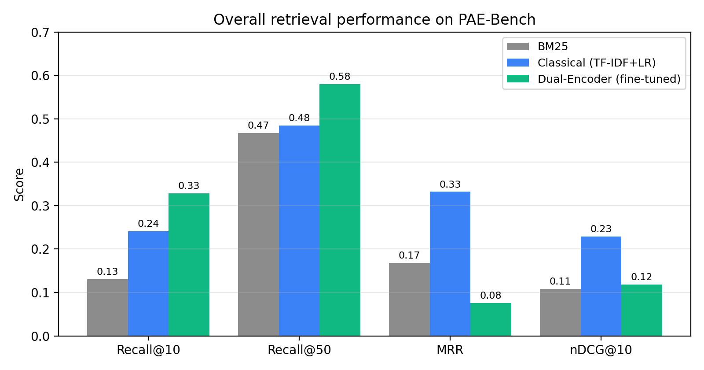

<!-- PAEwall — Demo Day Slides
     Rubric: Problem · Approach · Live Demo · Results  (5 min hard stop)
     Render: npx @marp-team/marp-cli@latest slides/demo_day_slides.md --pdf
     Figures live in ../paper/figures/ relative to this file. -->

<!-- _class: lead -->

# PAEwall
### Automated Patent Infringement Discovery

**Shreya Mendi** · Duke MEng AIPI · April 2026

> *Given a patent, find who's infringing it — and prove it.*

`github.com/Shreya-Mendi/PAEwall` · `paewall-production.up.railway.app`

---

## Problem & Motivation

# $3B+/year market. Manual search.

A patent attorney today:

1. **Reads claim language** · 2. **Guesses companies** · 3. **Hand-searches 10-Ks & product pages** · 4. **Builds a claim chart line by line**

**Cost:** $500+/hour · weeks per patent · recall-limited — the right defendant is often missed.

**Who's locked out:** Individual inventors, small PAE funds, university tech-transfer, in-house counsel priced out of $50k+/year tools like Patlytics or IP.com.

**What's missing:** A public benchmark, a faithfulness-grounded pipeline, and a red-team module that gives both sides the same honest view of enforcement viability.

---

## Approach

# Three models, one benchmark, four modules.

**PAE-Bench** — 522 patent–defendant pairs from real federal litigation (2015–2024), assembled from CourtListener + Google Patents BigQuery + SEC EDGAR. *First public cross-vertical patent-to-product benchmark.*

```
Patent → [ Intake ] → [ Retrieval ] → [ Claim Chart + Faithfulness ] → [ Red Team ]
```

Three retrievers benchmarked head-to-head:

| Model | Recall@10 | Notes |
|---|---|---|
| BM25 (naive) | 13.0% | Keyword search fails — claim language ≠ marketing copy |
| TF-IDF + LR (classical) | 24.1% | Learned weights close part of the gap |
| **Dual-Encoder (fine-tuned)** | **32.8%** | **+152% vs BM25, +36% vs classical** |

PatentSBERTa (patent tower) · all-mpnet-base-v2 (product tower) · InfoNCE loss + hard negatives · FAISS index.

---

<!-- _class: lead -->

## Live Demo

# 🎤 Live Demo

**`paewall-production.up.railway.app`**

Patent I'll use: **`US-2014289857-A1`** — *Computer virus protection (email sandbox)*

You'll see, in ~60 seconds:

1. Claims auto-parsed from the patent
2. Top candidate infringers ranked by retrieval score
3. **Faithfulness-scored claim chart** — every limitation mapped to product evidence with a [0,1] confidence
4. **Red-team output** — non-infringement arguments + §101/102/103 invalidity risks + enforcement probability

End-to-end inference: **< 10 seconds.** FastAPI + FAISS + Duke LLM proxy.

---

## Results & Key Findings



**Headline:** Fine-tuned dense retrieval is the right primitive for patent → product matching. **+152% Recall@10 over BM25.**

**Software wins biggest:** R@10 = 53% with the dual encoder — semantic match works when both sides are text-rich.

**Classical still wins MRR:** ranking calibration is data-limited at n=49 test. Next lever: cross-encoder re-rank.

**Error analysis (§7)** surfaced a data-coverage problem: 4 of top-5 BM25 misses are **IP-holding entities** (Valtrus, Clearly IP) with empty 10-K product sections. Not a model failure — a corpus gap.

**Commercial viability:** Public benchmark + faithfulness scoring + co-generated red team is an **unoccupied wedge** — Patlytics, IP.com, ClaimChart LLM publish nothing. Per-query cost ~$0.04; $5–$10 SaaS price clears 10–20× gross margin. Positioned as attorney triage, not replacement.

**Ethics built-in:** every chart ships with a faithfulness score; every retrieval ships with the defense's argument. **The tool raises the cost of frivolous assertion.**

---

<!-- _class: lead -->

# Thank you

**Shreya Mendi** · `shreya.mendi@duke.edu` · Duke MEng AIPI

Code: `github.com/Shreya-Mendi/PAEwall`
Live: `paewall-production.up.railway.app`
Paper: `paper/paewall_paper.md` · `paper/paewall_paper.tex`
